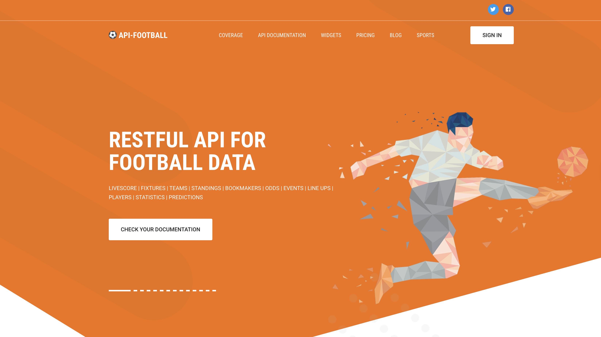
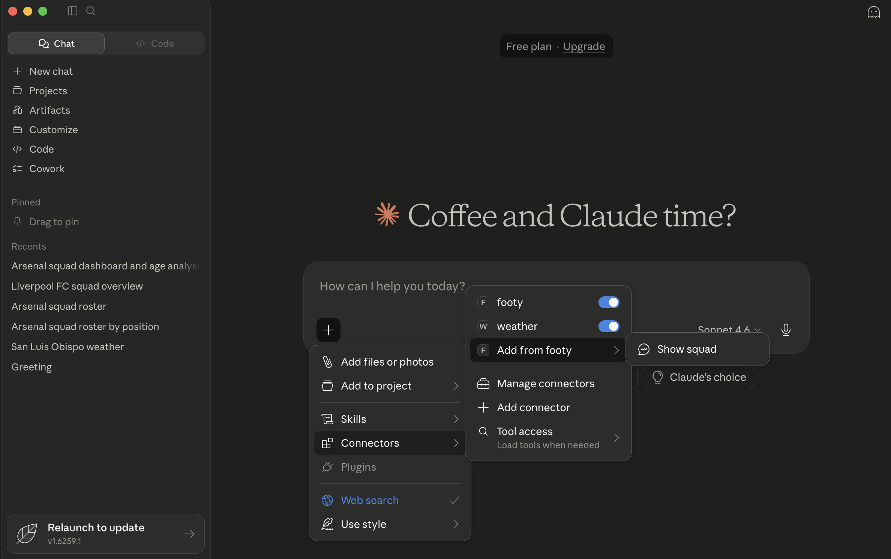
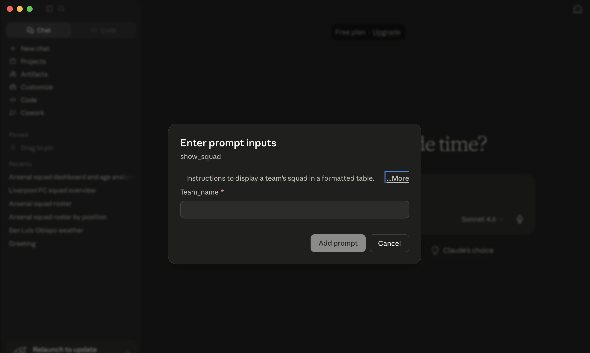
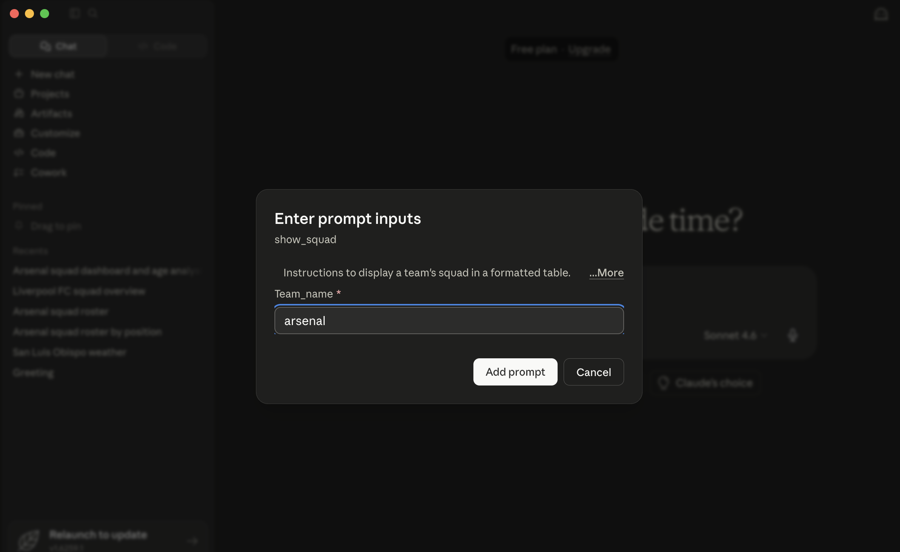
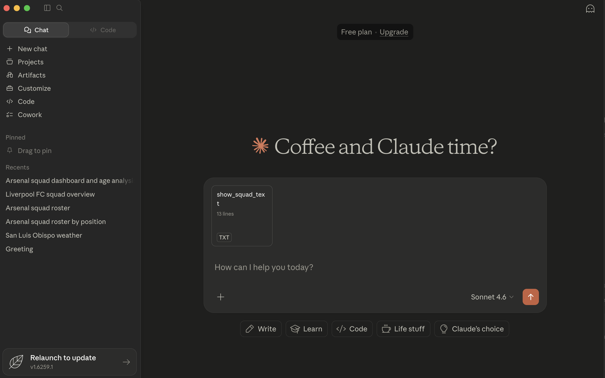
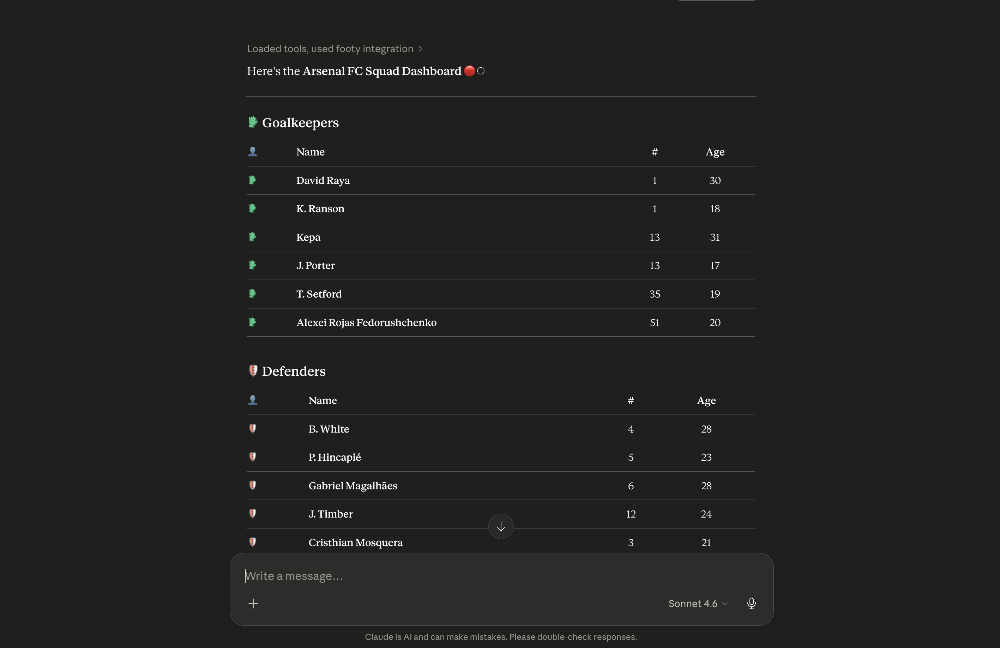
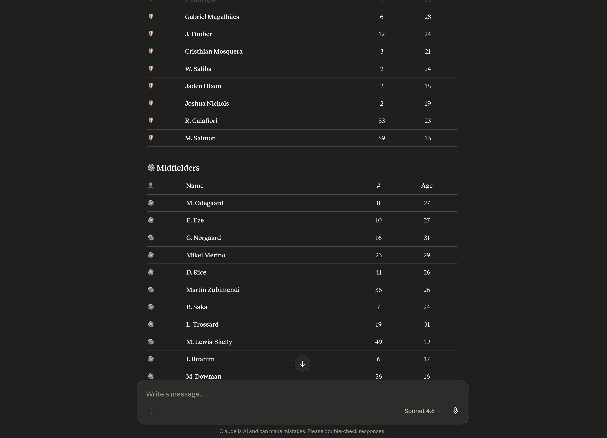
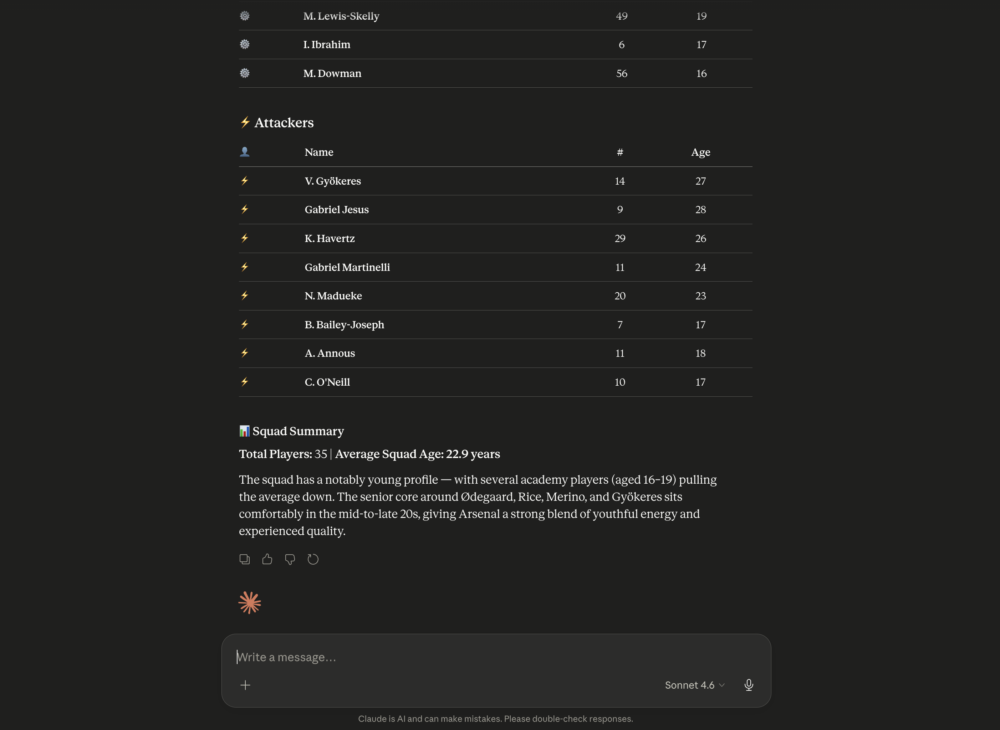

# API-Football-MCP ⚽️
<div align="center">
  
  <br><br>
</div>

# Overview 👀
This is an MCP Server for the API Football suite of APIs: https://www.api-football.com/documentation-v3
It has been built using Python and Anthropic's MCP Package.

# Server Setup 🛠️
In order to use this server the following would be needed:
- [**API-Football API Key**](https://www.api-football.com/)
- [**Python 3.12 or greater**](https://www.python.org/)
- [**Claude Desktop (Similar MCP Clients could be used as alternatives)**](https://claude.com/download)

Once the above has been downloaded and setup, clone the git repository and enter the following commands from the terminal at the root of the project:

```
python3.12 -m venv .venv
source .venv/bin/activate
pip install -r requirements.txt
```

The above creates a Virtual Environment using Python 3.12, activates it and installs required dependencies. A version of Python greater than 3.12 is fine to use, do adjust the above commands accordingly.

# Claude Desktop Setup 🛠️

Retrieve the absolute path of the working directory with the following command:
```
pwd
```
Afterwards rertieve the absolute path of the Python Executable with the following command:
```
which python3
```

With the above Open & Modify the Claude Config file.
To Open the Config File:
```
open -e "~/Library/Application Support/Claude/claude_desktop_config.json"
```
Modify with the following contents:
```
"mcpServers": {
    "footy": {
     "command": "PYTHON_EXECUTABLE_ABSOLUTE_PATH",
      "args": [
        "PROJECT_ABSOLUTE_PATH/main.py"
      ]
    }
}
```
# Claude Desktop Usage 💻
Once both the server setup and claude desktop setup are complete, the MCP Server should be available for use within the Claude Desktop Application. To use it access the `+` icon to locate the footy MCP Connector.

As of now, only one prompt - `show_squad` - is available.

The above fetches the most up to date squad of a Football team from Fottball-API and presents it in an organized tabular format. Below are images of this workflow.
<div align="center">
  
  <br><br>
</div>
<div align="center">
  
  <br><br>
</div>
<div align="center">
  
  <br><br>
</div>
<div align="center">
  
  <br><br>
</div>
<div align="center">
  
  <br><br>
</div>
<div align="center">
  
  <br><br>
</div>
<div align="center">
  
  <br><br>
</div>


This is just one use case. API-Football is an API with powerful capabilities, opening the possibility for this MCP Server to provide more exciting features such as live betting odds and transfer history of players.


# Forking & Contribution 🍴
Forking, Contributions and feedback are more than welcomed. 

When forking and/or contributing to this project , please do pay attention to: [LICENSE](./LICENSE)


☕☕☕**CHEERS AND THANK YOU**☕☕☕